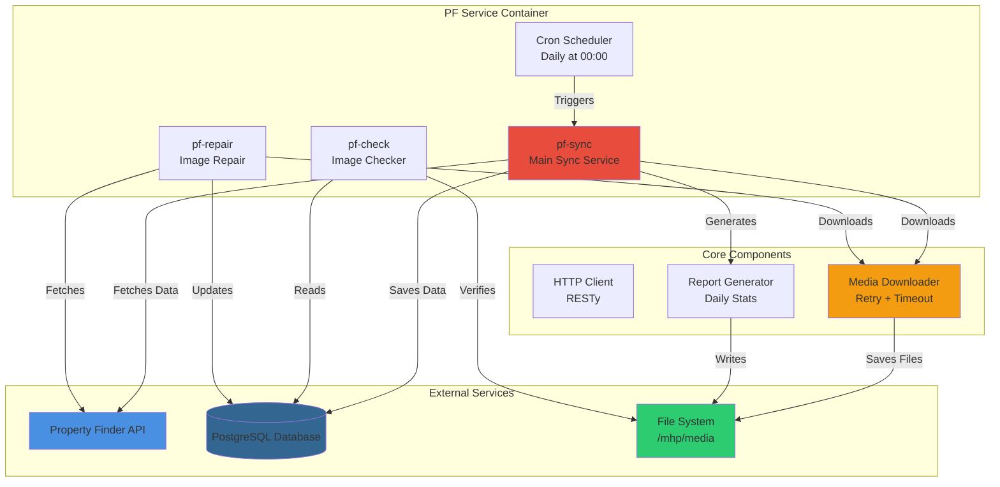
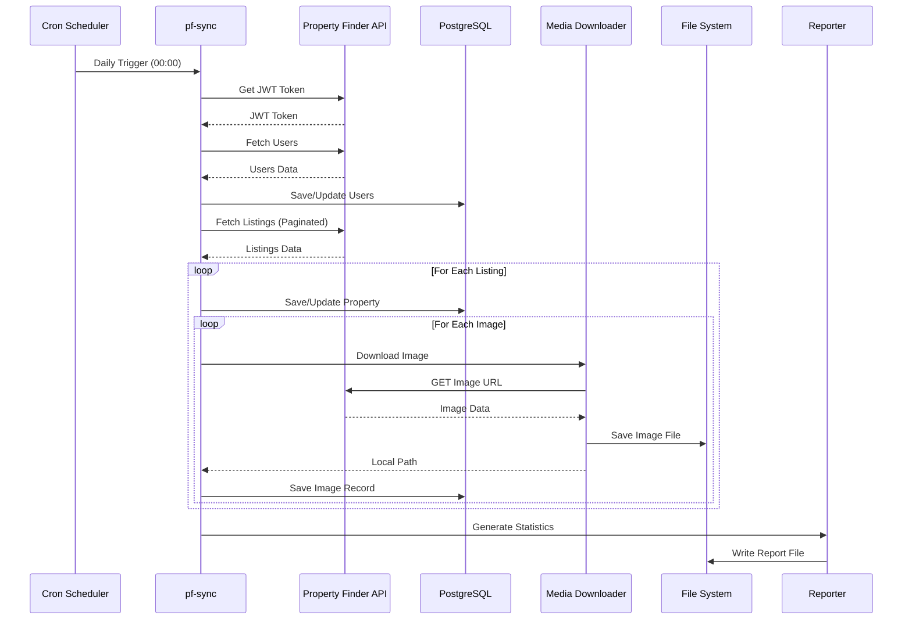

# 🏠 Property Finder Service

<div align="center">


**Enterprise-grade synchronization service for Property Finder API integration**

[Features](#-features) • [Architecture](#-architecture) • [Installation](#-installation) • [Usage](#-usage) • [API Reference](#-api-reference)

</div>

---

## 📋 Table of Contents

- [Overview](#-overview)
- [Features](#-features)
- [Architecture](#-architecture)
- [Installation](#-installation)
- [Configuration](#-configuration)
- [Usage](#-usage)
- [API Reference](#-api-reference)
- [Testing](#-testing)
- [Deployment](#-deployment)
- [Troubleshooting](#-troubleshooting)
- [Contributing](#-contributing)

---

## 🎯 Overview

**Property Finder Service** is a robust, production-ready Go microservice designed to synchronize property listings, user data, and media files from the Property Finder API into a PostgreSQL database. The service ensures data consistency, handles image downloads with retry mechanisms, and provides comprehensive reporting capabilities.

### Key Capabilities

- 🔄 **Automated Synchronization**: Daily sync of properties, users, and images
- 🖼️ **Intelligent Image Management**: Automatic download with retry logic and missing file detection
- 📊 **Comprehensive Reporting**: Daily statistics tracking with Tashkent timezone support
- 🛡️ **Data Safety**: Read-only operations ensure no accidental data deletion
- ⚡ **High Performance**: Concurrent processing with configurable timeouts
- 🔍 **Health Monitoring**: Built-in image existence verification and repair tools

---

## ✨ Features

### Core Functionality

| Feature | Description | Status |
|---------|-------------|--------|
| **Property Sync** | Fetches and syncs property listings from Property Finder API | ✅ Production |
| **User Management** | Synchronizes agent/user data with automatic updates | ✅ Production |
| **Image Download** | Downloads property images with retry mechanism (3 attempts) | ✅ Production |
| **Missing Image Detection** | Identifies and reports missing image files | ✅ Production |
| **Image Repair** | Automated re-download of missing images | ✅ Production |
| **Daily Reporting** | Generates daily sync statistics reports | ✅ Production |
| **Timezone Support** | Tashkent timezone (Asia/Tashkent) for all timestamps | ✅ Production |

### Advanced Features

- 🔁 **Retry Logic**: Configurable retry attempts (default: 3) with exponential backoff
- ⏱️ **Timeout Protection**: Prevents long-running downloads from blocking CPU
- 📁 **Unique Filenames**: UUID-based or property ID-based unique image naming
- 🔒 **Database Safety**: Zero deletion operations - only create/update operations
- 📈 **Statistics Tracking**: Tracks created/updated records, downloaded images, and errors
- 🐳 **Docker Ready**: Multi-stage Docker build with Alpine Linux base

---

## 🏗️ Architecture

### System Architecture Diagram



### Data Flow



### Component Structure

```
pf-service/
├── cmd/
│   ├── pf_sync/          # Main synchronization service
│   ├── pf_check/         # Image existence checker
│   └── pf_repair/         # Missing image repair tool
├── internal/
│   ├── config/           # Configuration management
│   ├── httpclient/        # HTTP client (RESTy)
│   ├── db/               # Database operations (GORM)
│   ├── media_download/    # Image download with retry
│   ├── property/         # Property models & mapping
│   ├── users/            # User models & mapping
│   ├── area/             # Area mapping
│   └── reporting/        # Daily statistics reporting
└── Dockerfile            # Multi-stage Docker build
```

---

## 🚀 Installation

### Prerequisites

- **Go 1.23+** (for local development)
- **Docker & Docker Compose** (for containerized deployment)
- **PostgreSQL 15+** database
- **Property Finder API** credentials

### Quick Start

#### 1. Clone the Repository

```bash
git clone https://github.com/your-org/pf-service.git
cd pf-service
```

#### 2. Build Docker Image

```bash
docker build -t pf-service:latest .
```

#### 3. Configure Environment

Create `.env` file or set environment variables:

```bash
# Property Finder API
PF_API_URL=https://api.propertyfinder.ae
PF_API_KEY=your-api-key
PF_API_SECRET=your-api-secret

# Database
POSTGRES_DSN=host=localhost user=postgres password=pass dbname=postgres port=5432 sslmode=disable

# Media Storage
MEDIA_ROOT=/mhp/media

# Image Download Settings
IMAGE_DOWNLOAD_MAX_RETRIES=3
IMAGE_DOWNLOAD_RETRY_DELAY=2
IMAGE_DOWNLOAD_TIMEOUT=10

# Reporting
REPORT_FILE=/var/log/report.txt
```

#### 4. Run with Docker Compose

```yaml
services:
  pf-sync:
    image: pf-service:latest
    environment:
      - MEDIA_ROOT=/mhp/media
      - PF_API_URL=${PF_API_URL}
      - PF_API_KEY=${PF_API_KEY}
      - PF_API_SECRET=${PF_API_SECRET}
      - POSTGRES_DSN=${POSTGRES_DSN}
    volumes:
      - /mhp/media:/mhp/media
      - ./logs:/var/log
    restart: unless-stopped
```

---

## ⚙️ Configuration

### Environment Variables

| Variable | Description | Default | Required |
|----------|-------------|---------|----------|
| `PF_API_URL` | Property Finder API base URL | - | ✅ Yes |
| `PF_API_KEY` | Property Finder API key | - | ✅ Yes |
| `PF_API_SECRET` | Property Finder API secret | - | ✅ Yes |
| `POSTGRES_DSN` | PostgreSQL connection string | - | ✅ Yes |
| `MEDIA_ROOT` | Media files root directory | `/mhp/media` | ❌ No |
| `IMAGE_DOWNLOAD_MAX_RETRIES` | Max retry attempts for image download | `3` | ❌ No |
| `IMAGE_DOWNLOAD_RETRY_DELAY` | Delay between retries (seconds) | `2` | ❌ No |
| `IMAGE_DOWNLOAD_TIMEOUT` | Download timeout (seconds) | `10` | ❌ No |
| `REPORT_FILE` | Path to daily report file | `/var/log/report.txt` | ❌ No |
| `TZ` | Timezone | `Asia/Tashkent` | ❌ No |

### Configuration File Example

```go
// config/config.go
type Config struct {
    PFAPIUrl    string
    PFAPIKey    string
    PFAPISecret string
    PostgresDSN string
}
```

---

## 📖 Usage

### Running the Sync Service

#### Manual Execution

```bash
# Run sync once
docker exec pf-service /app/pf-sync

# Or locally
cd pfservice
go run ./cmd/pf_sync
```

#### Scheduled Execution (Cron)

The service runs automatically daily at midnight (00:00) via cron:

```cron
0 0 * * * /app/pf-sync --sync >> /var/log/pf-sync.log 2>&1
```

### Checking Missing Images

```bash
# Check for missing images (read-only)
docker exec pf-service /app/pf-check

# Output example:
# ✓ No missing images found. All images are present.
# OR
# ✗ Found 4851 missing images:
#   Property ID 1061 (pf_id: Z1XHGC2QB0ARA317TMC2F5K2ZW): 29 missing images
```

### Repairing Missing Images

```bash
# Repair missing images (re-downloads from API)
docker exec pf-service /app/pf-repair

# Output example:
# PF IMAGE REPAIR STARTED...
# Found 4851 missing images. Starting repair...
# Successfully repaired image for property 1061: property_images/ce5950dd-d4b0-478e-ad32-176b8900bef1.jpg
```

### Viewing Daily Reports

```bash
# View daily sync statistics
cat /var/log/report.txt

# Output format:
# Date                | Properties Created | Properties Updated | Images Downloaded | Users Created | Users Updated | Errors
# 2026-01-19 00:00:00 | 15                | 234                | 1245              | 2             | 12            | 0
```

---

## 🔌 API Reference

### Property Finder API Integration

#### Authentication

```go
// Get JWT Token
token, err := httpclient.GetJWTToken()
// Returns: JWT access token string
```

#### Fetch Users

```go
// Fetch all users
users, err := httpclient.FetchAllUsers(token)
// Returns: []users.PFUser
```

#### Fetch Listings

```go
// Fetch listings (paginated)
listings, err := httpclient.FetchListings(token, page)
// Returns: ListingsResponse with Results array
```

### Database Operations

#### Save/Update User

```go
user := users.DjangoUser{
    Email: "agent@example.com",
    Phone: "+971501234567",
    Role:  "agent",
}
savedUser, err := db.SaveOrUpdateUser(dbConn, user)
```

#### Save/Update Property

```go
property := property.DjangoProperty{
    PfID:       "listing-id",
    UserID:     &userID,
    AreaID:     3782,
    Bedrooms:   2,
    Bathrooms:  2,
    Price:      1500000,
    StatusType: "sale",
}
savedProp, err := db.SaveOrUpdateProperty(dbConn, property, title, description)
```

#### Download Image

```go
localPath, err := media.DownloadImage(imageURL, propertyID, imageIndex)
// Returns: relative path like "property_images/uuid.jpg"
```

---

## 🧪 Testing

### Running Tests

```bash
# Unit tests
cd pfservice
go test ./internal/media_download/... -v

# Integration tests (requires database)
go test ./cmd/pf_sync/... -v -tags=integration

# All tests
go test ./... -v
```

### Test Coverage

```bash
go test ./... -cover
```

### Test Results

✅ **All tests passing** (12/12)

- `TestDownloadImageUniqueFilenames` ✅
- `TestDownloadImageFilenameWithUUID` ✅
- `TestDownloadImageWithRetry` ✅
- `TestDownloadImageWithTimeout` ✅
- `TestSyncDoesNotDeleteDatabaseRecords` ✅
- And more...

---

## 🚢 Deployment

### Docker Deployment

#### Build Image

```bash
docker build -t registry.gitlab.com/master-homes-groups/pf-service:latest .
```

#### Push to Registry

```bash
docker push registry.gitlab.com/master-homes-groups/pf-service:latest
```

#### Deploy with Docker Compose

```yaml
pf-sync:
  image: registry.gitlab.com/master-homes-groups/pf-service:latest
  container_name: pf-service
  env_file:
    - /mhp/api/.env
  environment:
    - MEDIA_ROOT=/mhp/media
  volumes:
    - /mhp/media:/mhp/media
    - ./logs:/var/log
  restart: unless-stopped
```

### Production Checklist

- [ ] Environment variables configured
- [ ] Database connection tested
- [ ] Media directory mounted with correct permissions
- [ ] Cron schedule verified
- [ ] Log rotation configured
- [ ] Monitoring alerts set up
- [ ] Backup strategy in place

---

## 🔧 Troubleshooting

### Common Issues

#### 1. Image Download Failures

**Problem**: Images not downloading (403 errors)

**Solution**:
- Check API credentials
- Verify image URLs are accessible
- Check network connectivity
- Review timeout settings

```bash
# Check logs
docker logs pf-service

# Verify image URLs
docker exec pf-service /app/pf-check
```

#### 2. Database Connection Errors

**Problem**: `failed to connect to database`

**Solution**:
- Verify `POSTGRES_DSN` is correct
- Check database is running
- Verify network connectivity
- Check firewall rules

#### 3. Permission Denied Errors

**Problem**: `permission denied` when writing files

**Solution**:
- Check volume mount permissions
- Verify `MEDIA_ROOT` directory exists
- Check file system permissions

```bash
# Fix permissions
chmod -R 755 /mhp/media
chown -R www-data:www-data /mhp/media
```

#### 4. Missing Images After Sync

**Problem**: Images in database but files missing

**Solution**:
- Run `pf-check` to identify missing images
- Run `pf-repair` to re-download missing images
- Check disk space availability

---

## 📊 Performance Metrics

### Benchmarks

| Operation | Average Time | Notes |
|-----------|--------------|-------|
| JWT Token Fetch | ~200ms | Single request |
| Users Fetch | ~500ms | All users |
| Listings Fetch (per page) | ~1-2s | 50 listings per page |
| Image Download | ~500ms-2s | Depends on image size |
| Full Sync (1000 properties) | ~15-30min | With 5 images per property |

### Optimization Tips

1. **Increase Retry Delay**: For slow networks, increase `IMAGE_DOWNLOAD_RETRY_DELAY`
2. **Adjust Timeout**: For large images, increase `IMAGE_DOWNLOAD_TIMEOUT`
3. **Database Indexing**: Ensure indexes on `pf_id`, `property_id` columns
4. **Concurrent Downloads**: Consider implementing concurrent image downloads (future enhancement)

---

## 🔒 Security

### Best Practices

- ✅ **No Hardcoded Secrets**: All credentials via environment variables
- ✅ **Read-Only Operations**: No database deletion operations
- ✅ **Input Validation**: All API responses validated
- ✅ **Error Handling**: Comprehensive error handling prevents crashes
- ✅ **Timeout Protection**: Prevents resource exhaustion

### Security Checklist

- [ ] API credentials stored securely (not in code)
- [ ] Database credentials encrypted
- [ ] Network traffic over HTTPS
- [ ] File system permissions restricted
- [ ] Log files don't contain sensitive data

---

## 🤝 Contributing

### Development Setup

1. Fork the repository
2. Create a feature branch: `git checkout -b feature/amazing-feature`
3. Make your changes
4. Write tests for new functionality
5. Ensure all tests pass: `go test ./... -v`
6. Commit your changes: `git commit -m 'Add amazing feature'`
7. Push to branch: `git push origin feature/amazing-feature`
8. Open a Pull Request

### Code Style

- Follow Go standard formatting: `gofmt -s -w .`
- Use `golint` for code quality
- Write comprehensive tests
- Document public functions

### Testing Requirements

- All new features must have tests
- Test coverage should not decrease
- Integration tests for database operations
- Mock external API calls in unit tests

---

## 📝 License

This project is proprietary software. All rights reserved.

---

## 👥 Authors

- **Development Team** - Master Homes Group

---

## 🙏 Acknowledgments

- Property Finder API team
- Go community
- Open source contributors

---

<div align="center">

**Made with ❤️ for Master Homes Group**

[Report Bug](https://github.com/your-org/pf-service/issues) • [Request Feature](https://github.com/your-org/pf-service/issues)

</div>
